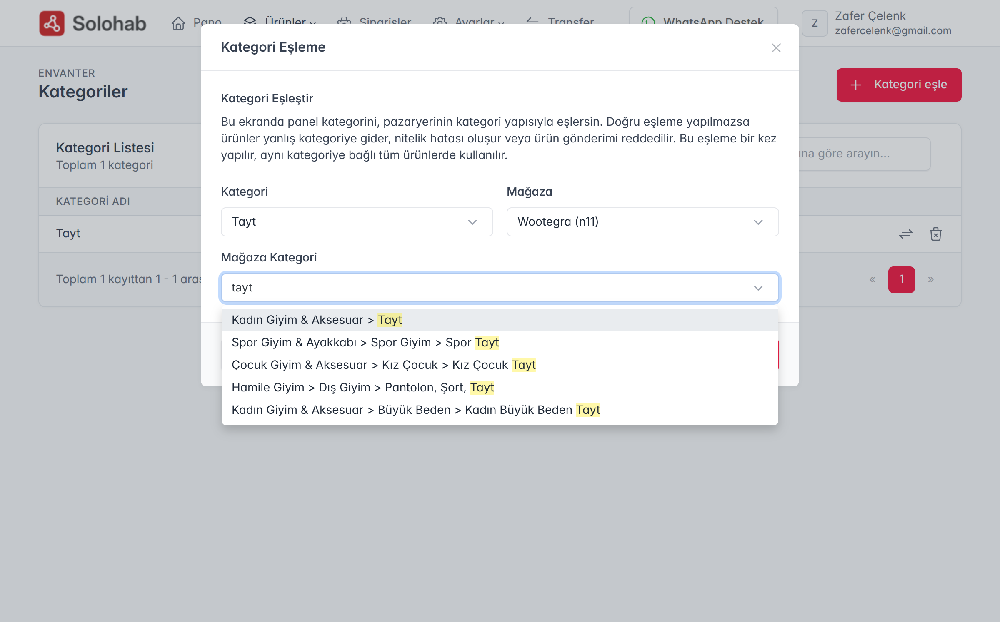
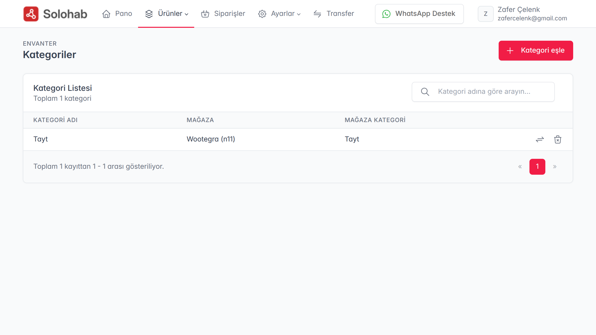
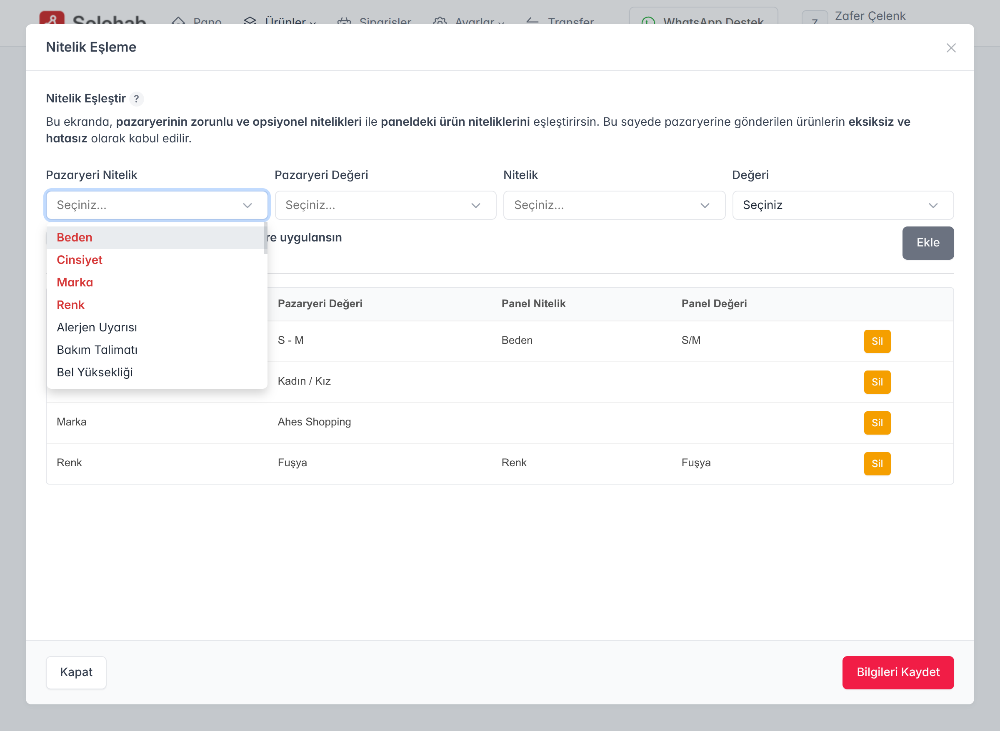

Solohab havuzundaki ürünlerinizin pazar yerlerinde (Trendyol, n11 vb.) doğru kategoride ve doğru özelliklerle listelenmesi için **"Eşleme"** işlemi hayati önem taşır. Bu makalede, ürünlerinizi pazar yeri standartlarına nasıl uygun hale getireceğinizi öğreneceksiniz.

### 1. Kategori Eşleme Nedir?
Her pazar yerinin kendine has bir kategori ağacı vardır. Örneğin; sizin sisteminizdeki "Erkek Tişört" kategorisi, Trendyol'da "Erkek > Giyim > Üst Giyim > Tişört" yolunu izler.
1.  **Ayarlar > Kategori Eşleme** menüsüne gidin.
2.  Sol taraftan **Kendi Kategorinizi** seçin.
3.  Sağ taraftan hedef **Pazar Yerini** (Örn: n11) seçin.
4.  n11 kategori listesinden ürününüze en uygun son kategoriyi bulun ve **"Eşleştir"** butonuna basın.
5.  Açılan alt panelde, zorunlu alanları (Marka, Renk vb.) kendi verilerinizle eşleyerek **"Kaydet"** deyin.

### 2. Eşlenen Kategorileri Listeleme
Kategoriyi seçtikten sonra, bilgileri kaydet butonu ile bu kategori eşlemesini Solohab sistemine kaydedin. Ardından eşlenen kategorilerin listelendiği kategori listeleme sayfasına döneceksiniz. Kategori listesinden eşlenen her kategorinin yanından nitelik eşleme veya mevcut eşlemeyi silmek için ikonlar mevcuttur. Buradan eşlemeyi silmek için silme ikonunu kullanabilirsiniz. Nitelik eşlemek için ise nitelik eşleme ikonnuna basarak nitelik eşleme penceresini açmalısınız.

### 3. Nitelik ve Değer Eşleme Süreci

Kategori eşleşmesini tamamladıktan sonra, pazar yerinin o kategori için zorunlu tuttuğu teknik detayları (Renk, Beden, Materyal vb.) Solohab verilerinizle senkronize etmeniz gerekir.

**Nitelik Eşleme Penceresinin Kullanımı:**

* **Eşleme Mantığı:** Pencerenin üst bölümünde yer alan seçim kutularında; **sol tarafta** pazar yeri nitelikleri, **sağ tarafta** ise Solohab panelindeki karşılıkları yer alır. Uygun değerleri seçip "Ekle" butonuna bastığınızda eşleşme alt listeye aktarılır.
* **Zorunlu Alanlar (Kırmızı):** Pazar yeri tarafından doldurulması zorunlu olan nitelikler **kırmızı renkli** olarak vurgulanır. Ürünlerinizin pazar yerinde reddedilmemesi için bu alanları mutlaka eşlemelisiniz.
* **Serbest Metin Girişi:** Eğer pazar yeri ilgili nitelik için ön tanımlı bir liste yerine dışarıdan metin girişine izin veriyorsa, seçim kutusu otomatik olarak metin girişi özelliğine bürünür.
* **Toplu Değer Atama (Checkbox):** Eğer ilgili nitelik Solohab panelinizde tanımlı değilse (Örn: Tüm ürünleriniz "Pamuklu" ama panelde bu veri kayıtlı değilse), **"Bu eşleşme kategorideki tüm ürünlere uygulansın"** kutucuğunu işaretleyebilirsiniz. Böylece panelde veri aramaya gerek kalmadan, o nitelik tüm ürünleriniz için pazar yerine gönderilir.

**Yönetim ve Kayıt:**
Tüm eşleşmeleri tamamladığınızda **"Bilgileri Kaydet"** düğmesine basarak listeyi sisteme tanımlayın. Bu ekran üzerinden dilediğiniz zaman mevcut eşleşmeleri silebilir veya yeni eşleşmeler ekleyerek pazaryeri nitelik eşleme yapınızı güncel tutabilirsiniz.

