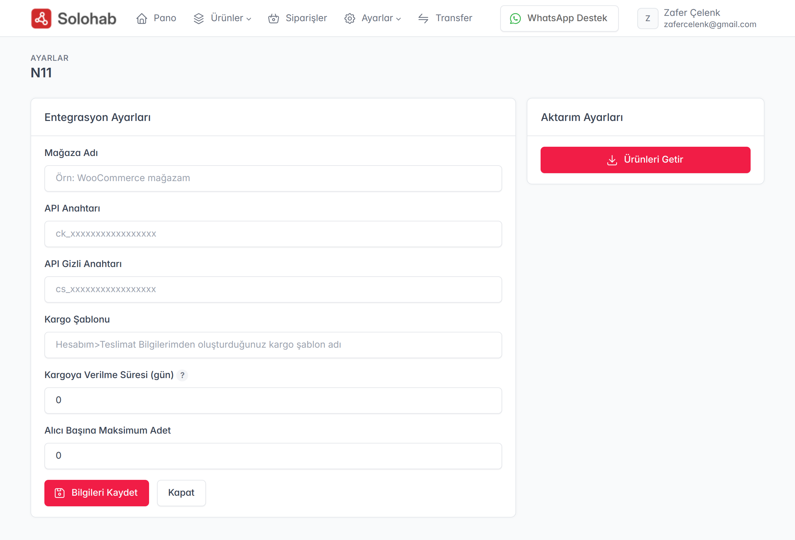
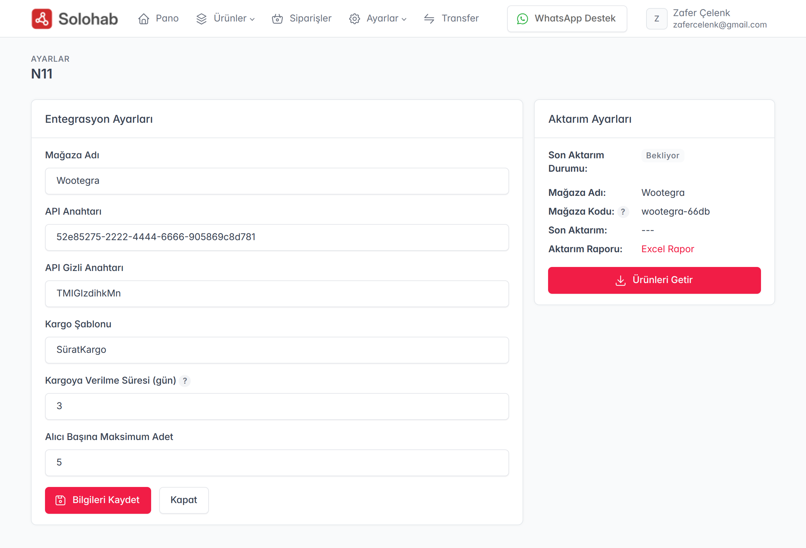

Solohab üzerinden n11 mağazanızı yönetmek, ürünlerinizi n11 kataloğuna göndermek ve siparişlerinizi takip etmek için öncelikle n11 API bağlantısını kurmanız gerekmektedir. Bu rehberde, n11 mağazanızı Solohab sistemine nasıl entegre edeceğinizi adım adım göreceğiz.

### 1. n11 API Bilgilerinin Temin Edilmesi
n11 entegrasyonu için öncelikle n11 Mağaza Paneli üzerinden API anahtarlarınızı oluşturmalısınız:
* **n11 Mağaza Paneli**ne giriş yapın.
* Üst menüden **"Hesabım" > "API Hesapları"** sekmesine gidin.
* **"Yeni API Şifresi Oluştur"** butonuna basarak size özel oluşturulan **API Key (Uygulama Anahtarı)** ve **API Secret (Uygulama Şifresi)** bilgilerini not edin.

> **Önemli Not:** n11 güvenlik gereği API şifresini sadece bir kez gösterir ve belirli aralıklarla e-posta onayı isteyebilir. Şifrenizi kaydettiğinizden emin olun.

### 2. Solohab Panelinde Mağaza Ayarları
Solohab yönetim panelinizde:
* Üst menüden **"Ayarlar"** ve ardından **"Mağaza Ayarları"** seçeneğine tıklayın.
* Mağaza listesi sayfasının sağ üst köşesindeki **"Yeni Ekle"** butonuna basın.
* Açılan platform seçeneklerinden **n11** ikonunu seçerek devam edin.

### 3. n11 API Bağlantısını Kurma
n11 ayar sayfası açıldığında, n11 panelinden aldığınız bilgileri ilgili alanlara girin:
* **Mağaza Adı:** Solohab içerisinde mağazanızı tanıyacağınız bir isim verin.
* **App Key (Uygulama Anahtarı):** n11'den aldığınız API Key bilgisini buraya yapıştırın.
* **App Secret (Uygulama Şifresi):** n11'den aldığınız API Secret bilgisini buraya yapıştırın.
* **Kargo Şablonu:** n11'den aldığınız kargo şablon adını buraya yapıştırın.
* **Kargoya Verilme Süresi:** Ürünü kargoya vereceğiniz süreyi ekleyin.
* **Alıcı Başına Maksimum Adet:** Alıcının aynı üründen maksimum alabileceği adet miktarı.

Giriş yaptıktan sonra alt kısımdaki **"Bilgileri Kaydet"** butonuna basarak işlemi tamamlayın.

### 4. Bağlantı Kontrolü ve Aktivasyon
Bilgiler kaydedildikten sonra sistem n11 sunucuları ile otomatik bir test bağlantısı kuracaktır. Bağlantı başarılı olduğunda:
* Sağ panelde n11 mağaza bilgileriniz ve **"Ürün Gönderim"** ayarları aktif hale gelecektir.
* Artık Solohab havuzundaki ürünlerinizi n11 kategorileriyle eşleştirerek tek tıkla satışa açmaya hazırsınız.

