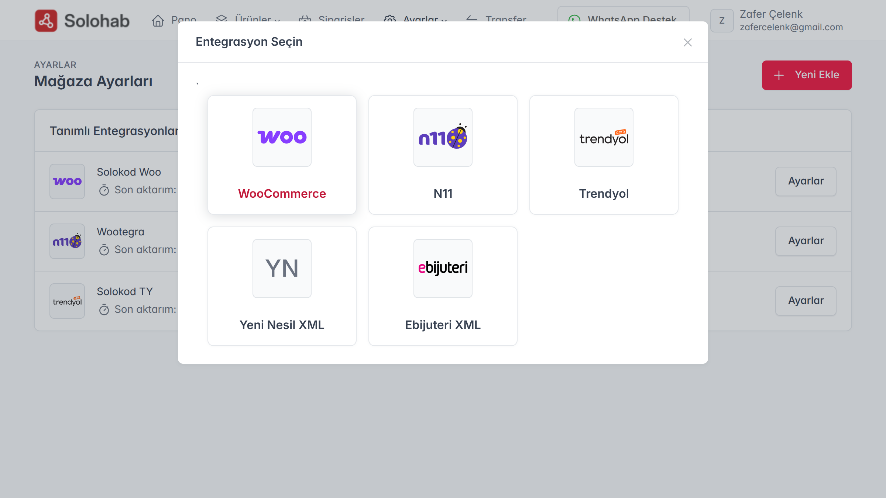
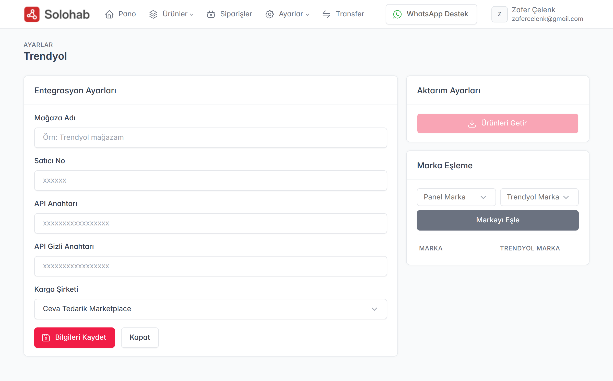
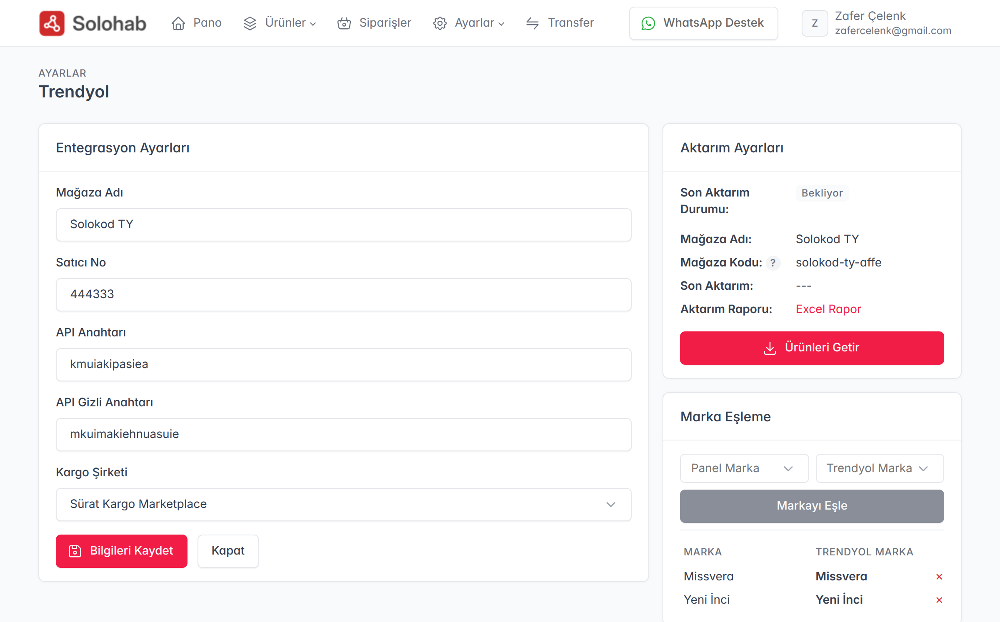

Solohab üzerinden Trendyol mağazanızı yönetmek, stoklarınızı anlık olarak güncellemek ve sipariş operasyonunuzu hızlandırmak için Trendyol API bağlantısını kurmanız gerekmektedir. Bu rehberde, Trendyol mağazanızı Solohab sistemine nasıl entegre edeceğinizi adım adım inceleyeceğiz.

### 1. Trendyol API Bilgilerinin Temin Edilmesi
Trendyol entegrasyonu için gerekli olan "Satıcı ID", "API Key" ve "API Secret" bilgilerine ulaşmak için:
* **Trendyol Satıcı Paneli**ne ([partner.trendyol.com](https://partner.trendyol.com)) giriş yapın.
* Sağ üst köşede bulunan **Mağaza Adınıza** tıklayın ve açılan menüden **"Hesap Bilgilerim"** seçeneğine gidin.
* Sayfanın sağ tarafındaki sekmelerden **"Entegrasyon Bilgileri"** kısmına tıklayın.
* Burada yer alan **Satıcı ID**, **API Key** ve **API Secret** bilgilerini bir kenara not edin veya kopyalayın.

> **İpucu:** Eğer bu alanda bir anahtar görünmüyorsa, "Yeni API Şifresi Oluştur" butonuna basarak bilgilerinizi anında oluşturabilirsiniz.

### 2. Solohab Panelinde Mağaza Ayarları
Solohab yönetim panelinizde:
* Üst menüden **"Ayarlar"** ve ardından **"Mağaza Ayarları"** seçeneğine tıklayın.
* Mağaza listesi sayfasının sağ üst köşesindeki **"Yeni Ekle"** butonuna basın.
* Açılan platform listesinden **Trendyol** ikonunu seçerek devam edin.

### 3. Trendyol API Bağlantısını Kurma
Trendyol ayar sayfası açıldığında, Trendyol panelinden kopyaladığınız bilgileri ilgili alanlara girin:
* **Mağaza Adı:** Mağazanızı Solohab içinde takip edebilmek için bir isim verin (Örn: Trendyol Mağazam).
* **Satıcı ID (Supplier ID):** Trendyol panelindeki "Satıcı ID" bilgisini buraya yapıştırın.
* **API Key:** Trendyol panelindeki "API Key" bilgisini buraya yapıştırın.
* **API Secret:** Trendyol panelindeki "API Secret" bilgisini buraya yapıştırın.
* **Kargo Şirketi:** Trendyol panelindeki seçilen kargo şirketi bilgisini buraya tanımlayın.

Girişleri tamamladıktan sonra **"Bilgileri Kaydet"** butonuna basın.

### 4. Aktivasyon ve Senkronizasyon
Kayıt işlemi başarılı olduktan sonra sistem Trendyol ile bağlantı testini gerçekleştirecektir:
* Bağlantı kurulduğunda, sağ panelde mağaza ve aktarım bilgileriniz aktif hale gelecek ve kullanılabilir olacaktır.
* **Ürünleri Getir:** "Ürünleri Getir" butonu ile Trendyol'daki mevcut ürünlerinizi Solohab havuzuna saniyeler içinde aktarabilirsiniz.
* **Marka Eşleme Modülü:** Solohab havuzundaki markalarınızı, Trendyol’un resmi marka kütüphanesi ile bu modül üzerinden eşleştirebilirsiniz. Böylece ürün gönderimlerinde "Marka Bulunamadı" hatalarının önüne geçerek sorunsuz bir listeleme süreci sağlarsınız.

