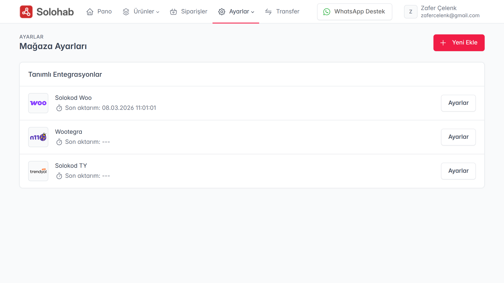
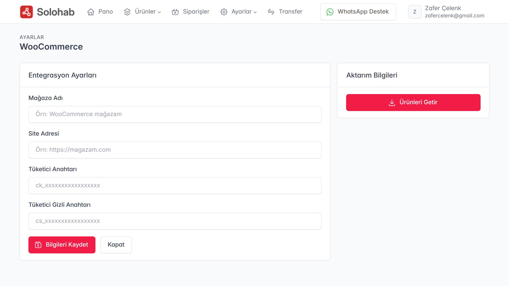
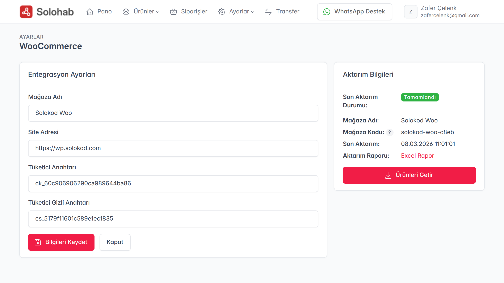

Solohab’ın güçlü stok ve ürün havuzu özelliklerinden faydalanmak için ilk adım, mağazanızı sisteme entegre etmektir. Bu rehberde, WooCommerce mağazanızı Solohab’a nasıl dakikalar içinde tanımlayacağınızı adım adım inceleyeceğiz.

### 1. Mağaza Ayarlarına Erişim
Solohab yönetim panelinize giriş yaptıktan sonra, üst menüde yer alan **"Ayarlar"** sekmesine tıklayın. Açılan alt menüden **"Mağaza Ayarları"** seçeneğine giderek, mevcut mağazalarınızın listelendiği yönetim sayfasına ulaşabilirsiniz.

### 2. Yeni Mağaza Ekleme
Mağaza listesi sayfasının sağ üst köşesinde bulunan **"Yeni Ekle"** butonuna basın. Karşınıza çıkan pencerede, entegre etmek istediğiniz platform seçeneklerini göreceksiniz. Bu aşamada **WooCommerce** logolu seçeneği işaretleyerek devam edin.

### 3. API Bilgilerinin Girilmesi ve Kayıt
WooCommerce platformunu seçtiğinizde, bağlantı ayarlarını yapacağınız özel form sayfası açılacaktır. Bu sayfada:
* **Genel Tanımlar:** Mağazanıza Solohab içinde vereceğiniz isim.
* **Site Tanımı:** Mağazanızın temel URL adresi.
* **API Anahtarları:** WooCommerce sitenizden temin ettiğiniz **"Tüketici Anahtarı" (Consumer Key)** ve **"Tüketici Gizli Anahtarı" (Consumer Secret)** bilgilerini ilgili alanlara yapıştırın.

Bilgileri kontrol ettikten sonra **"Bilgileri Kaydet"** düğmesine basarak tanımlama işlemini tamamlayın.

> **Not:** API anahtarlarınızı WooCommerce panelinizde *Ayarlar > Gelişmiş > REST API* sekmesinden oluşturabilirsiniz.

### 4. Ürün Çekme İşlemi
Bilgiler eksiksiz ve doğru şekilde kaydedildiğinde, sağ panelde mağazanıza ait genel bilgiler ve **"Ürün Çekme"** kontrol alanı aktif hale gelecektir. Artık sağ paneldeki komutları kullanarak WooCommerce üzerindeki ürünlerinizi tek tıkla **Solohab Havuzu**na aktarmaya başlayabilirsiniz.

